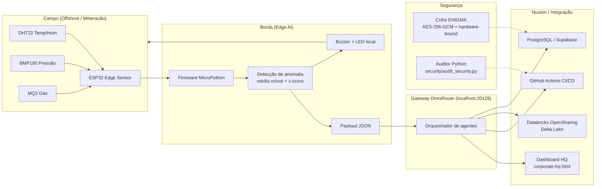

# Diagrama de Arquitetura — Kraefegg M.O.

Fluxo de ponta a ponta: sensores de campo → borda (Edge AI) → gateway → nuvem/Databricks → plataforma HQ.

## Camadas

| Camada | Tecnologia | Repositório |
|---|---|---|
| Campo | ESP32, DHT22, BMP180, MQ2 | `rd/embedded/` |
| Borda | MicroPython, Edge AI (z-score) | `rd/embedded/edge-sensor/main.py` |
| Gateway | OmniRoute v3.8.49 (rota/fallback de modelos) | `http://localhost:20128` |
| Nuvem | PostgreSQL/Supabase, Databricks (Delta Sharing) | `db/schema.sql`, `security/databricks.py` |
| Plataforma | Vanilla JS (HQ único) | `hq/corporate-hq.html` |
| Segurança | AES-256-GCM, PBKDF2 310k, auditor Python | `security/` |

## Fluxo de simulação (Wokwi)

1. `rd/embedded/edge-sensor/run_sim.py` baixa o firmware MicroPython oficial ESP32.
2. Injeta `main.py` no filesystem LittleFS da imagem de flash.
3. Envia `diagram.json` + firmware ao simulador Wokwi (servidor 1.0.0).
4. Monitora o serial e captura os payloads JSON com o z-score de anomalia.

## Trilha de auditoria

- `security/audit_log.jsonl` registra cada execução do auditor (append-only).
- O hook `security/hooks/pre-commit` roda o auditor em todo commit.
