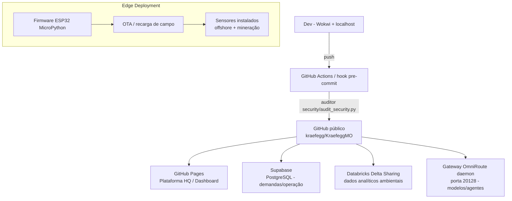

# Diagrama de Implantação (Deployments) — Kraefegg M.O.

Estratégia de deployments por ambiente e produto-serviço.

## Ambientes

| Ambiente | Onde roda | Propósito |
|---|---|---|
| Desenvolvimento | Local (Wokwi, gateway daemon) | Iteração de firmware e dashboard |
| CI | GitHub Actions + hook pre-commit | Auditoria de segurança, testes de simulação |
| Público | GitHub Pages (`deploy-github-pages.ps1`) | Dashboard operacional / HQ |
| Nuvem de dados | Supabase + Databricks | Armazenamento e analytics |
| Campo | ESP32 (Edge) | Coleta + inferência local de anomalia |

## Ciclo de release

1. Editar arquivos raiz do repo (`index.html`, `data.js`, `pages.js`, `style.css`, `app.js` para o AIO Observatory; ou `rd/`, `hq/`, `security/`, `db/` para KraefeggMO).
2. `git add` + `git commit` (hook roda o auditor).
3. `git push origin main` → CI/Pages/Databricks atualizam.
4. Firmware embarcado: simular no Wokwi, validar serial, então programar os dispositivos.
